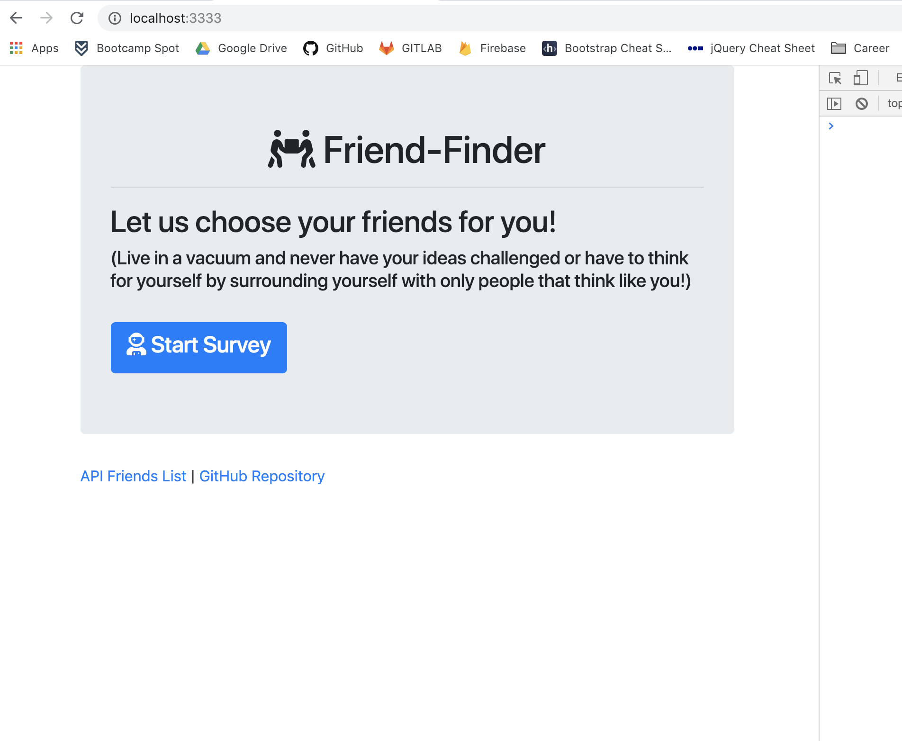
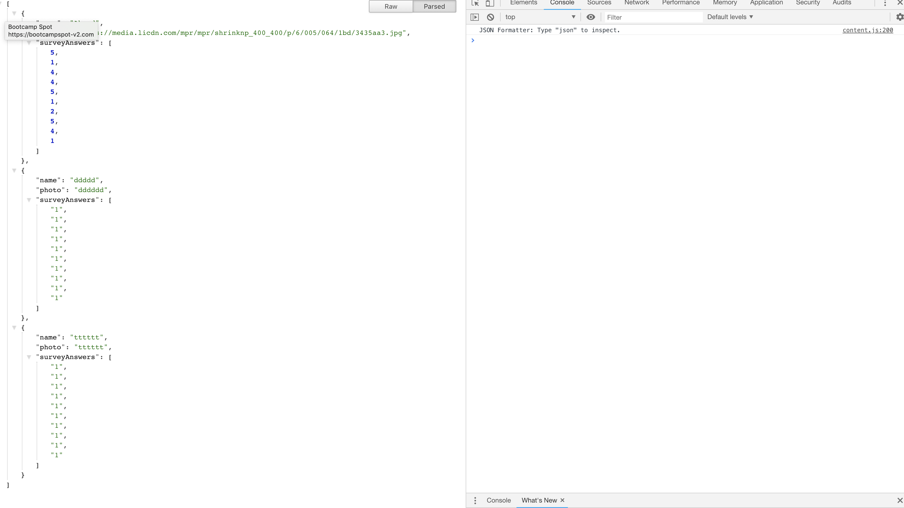

# FriendFinder
FriendFinder App

insulate yourself against other people who don't think like you with the friend finder app!

First you will need to download the app
then do an npm install to install the dependencies from your command line

from either PORT 3333 (localhost:3333) or whatever PORT heroku tells you to use, you can use the app to fill out a survey

the app will take your survey questions and compare it to the other users answers and show you the name and a link to a photo to the user that responded most similalry to you

I am having an erro that prevents the modal from actually appearing:
Error [ERR_HTTP_HEADERS_SENT]: Cannot set headers after they are sent to the client

I think it has something to do with the express headers or something but I don't really know and niether did my tutor.

Here are some screen shots:

I didn't get around to actually making questions...

